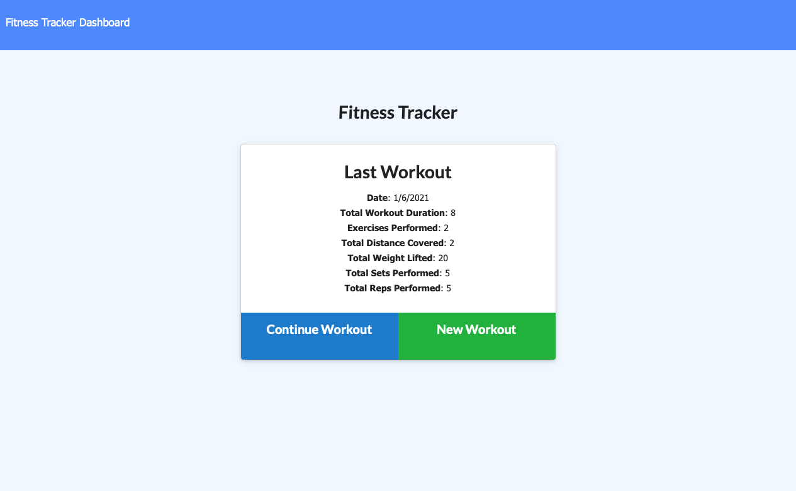

# workout-tracker

## Overview:

In this unit, we have covered and implemented the use of MongoDB, a popular noSQL database. Unlike SQL, which is a table-based relational model, this database employs a document-oriented model. Also, in contrast to SQL, noSQL terms include database, collection, document, and field. In addition to MongoDB, we have also covered the use of Mongoose, a MongoDB object modeling tool designed to work in an asynchronous environment.

With this new found expertise, we have been tasked to create fitness tracker. Although the front-end code was provided for this application, it was our responsibility to successfully build the back-end functionality. Upon completion of the app, the reader will find a fitness tracker that that was built with a Mongo database with a Mongoose schema and handle routes with Express.

Please find additional information regarding this project below. Thanks.

## Deployed Application Link

Please find the deployed webpage link here: https://enigmatic-citadel-15539.herokuapp.com/

## Screenshots of Generated Application

## Credits/Resources

1. MDN Web Docs - Mongoose: https://developer.mozilla.org/en-US/docs/Learn/Server-side/Express_Nodejs/mongoose

2. Node.js: https://expressjs.com/

3. NPM - Handlebars: https://handlebarsjs.com/

4. MySQL: https://www.mysqltutorial.org

## MIT License

Copyright (c) [2021] [Adebambo Adeshiyan]

Permission is hereby granted, free of charge, to any person obtaining a copy
of this software and associated documentation files (the "Software"), to deal
in the Software without restriction, including without limitation the rights
to use, copy, modify, merge, publish, distribute, sublicense, and/or sell
copies of the Software, and to permit persons to whom the Software is
furnished to do so, subject to the following conditions:

The above copyright notice and this permission notice shall be included in all
copies or substantial portions of the Software.

THE SOFTWARE IS PROVIDED "AS IS", WITHOUT WARRANTY OF ANY KIND, EXPRESS OR
IMPLIED, INCLUDING BUT NOT LIMITED TO THE WARRANTIES OF MERCHANTABILITY,
FITNESS FOR A PARTICULAR PURPOSE AND NONINFRINGEMENT. IN NO EVENT SHALL THE
AUTHORS OR COPYRIGHT HOLDERS BE LIABLE FOR ANY CLAIM, DAMAGES OR OTHER
LIABILITY, WHETHER IN AN ACTION OF CONTRACT, TORT OR OTHERWISE, ARISING FROM,
OUT OF OR IN CONNECTION WITH THE SOFTWARE OR THE USE OR OTHER DEALINGS IN THE
SOFTWARE.
